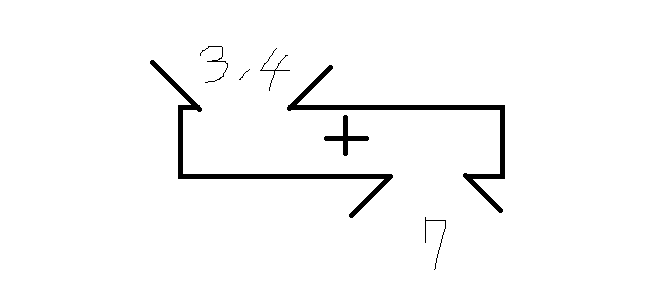

## 함수가 뭐야?

우선 함수라고 하면 어린 시절 수학시간을 떠올리면서 두통부터 호소하시는 분들이 계신데요~ C언어에서 말하는 함수도 그 때 배웠던 함수랑 똑같..비슷 습니다! 하하. 함수라고하면 저는 늘 마법주머니를 가지고 비유를 하는데요~


​

요로코롬 생겨 먹은 녀석을 말하죠. 요 녀석은 + 라고 하는 마법주머니에 3과 4를 집어넣으면 7이 나오는 기능을 하는데, C언어에서는 이와 같은 기능을 하는 녀석을 함수(funtion) 라고 부른답니다!

### C언어에서의 함수 

자 이제 C언어로 돌아가보죠, 우선은 위에서 언급한 3,4를 집어 넣으면 7이 나오도록 하는 예시를 보고 그다음으로 설명 해볼게요!

```
#include <stdio.h>
 
int sum ( int x, int y) {
    return x + y;
}
 
int main ( int argc, char ** argv ) {
 
    int result = sum( 3, 4 );
    
    printf("%d", result);
 
    return 0;
}
```
​
### 1) 위의 3~5번째 줄이 함수의 정의 부분입니다.

하나씩 풀어보겠습니다.

int : 반환되는 결과의 타입
sum : 함수의 이름
( int x , int y ) : 함수의 매개변수
{ 
return x + y; 결과
}

자 이제 우리는 뭘 알수가 있지요? "아 함수는 재료(매개변수)를 넣어주면 결과(반환)가 나오는 거구나. (뭔진 잘 모르겠지만), 그리고 그 녀석의 내용을 내가 만들수가 있네! 세상에나 이름까지 지어줄 수가 있어!! 이렇게 만능이 있을줄이야!!ㅠㅠ" 라는 생각을 가지실겁니다^^ 하하.

### 2) 위의 9번째 줄이 함수의 호출 부분입니다.

함수의 호출 같은 경우에는 미리 정의 되어있는 함수! (3~5번째 줄에 만들어둔 것)를 이름과 재료를 직접 넣어 주면서 호출 할 수가 있습니다!

### 3) ​그러니 이름을 잘 지어 두어야겠지요? ​

함수의 이름은 함수가 하는 기능을 의미하게 됩니다. 예를들어 위의 sum 함수 이름을 apple이라 지었을 때, 그 코드를 처음 보는 사람은 과연 무슨 기능인지 알 수 있을까요? 프로그래밍의 기본은 협업입니다. 많은 사람들이 여러분의 코드를 딱 보자마자 아~ 이거구나 하도록 함수의 이름을 기능을 잘 설명 하도록 동일시 하도록 지으면 됩니다.

### Q.  int main ( int argc , char ** argv ) 이거는요? 얘도 함수 인가요?

네 ​그 것도 함수입니다! 이름은 main 이며 반환타입은 int고 argc와 argv 라는 재료를 가지고 있군요,

### Q. 걔는 언제 호출 되나요 ?

main 함수는 여러분이 프로그램을 실행 시킬 때 가장 먼저 호출 되는 함수 입니다! 매개변수로 여러 문자열을 보내 줄 수 있는데, 그 문자열이 argv에 담기게 되고, 그 문자열의 갯수가 argc가 되지요^^! 보통은 리눅스 환경에서 프로그램을 실행 시킬 때 매개변수를 보내줍니다. 더 자세한 사용법은 구글검색 해보세요! 윗말이 잘 이해가 안 되시는 분들은, 아 main 이라는 애도 함수구나! 라고 아시면 되겠습니다.

### Q. 리턴 0은 뭔가요??

​main도 일종의 함수이기때문에 함수 마지막에는 항상 호출 지점에 반환되는 결과 값이 생기지요. 메인에서의 return 0은 정상종료를 의미합니다.

### 숙제

위의 예제에서 3,4를 넣으면 7이 아니라 1이 나도록 해보세요~~!!


