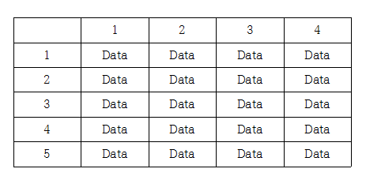

 

2차원 배열이란?

 지난시간에 배열은 수학에서 집합의 개념과 비슷하다고 했지요. 2차원 배열은 행렬과 유사한 모양이에요. 수학이 낯선 분들은 하나의 테이블이라고 이해하셔도 괜찮을 것 같아요!


    



<이런 느낌?>              


Q. C언어에선 어떻게 사용하는지 ?


위의 테이블같은 데이터를 C로 int table[5][4]; 와 같이 나타낼 수 있습니다!


타입명 변수이름[세로][가로];

 조금 더 심플하게 말하면 1차원 배열의 배열 입니다! 예를들어, int arr[4]; 이러한 데이터가 5개 더 있으면 int table[5][4]가 되는거죠!


Q. 뭐라는지 모르겠어요!! 그냥 예제를 보여주세요


(네...)


학생 다섯명의 성적을 구하는 프로그램입니다! 배열의 기본적인 개념은 지난시간에 배워봤으니 이정도는 식은죽 먹기로 볼 수 있으시겠죠~~?


간단한 설명만 첨부하겠습니다!


7번째줄 : studentScore라는 2차원 배열 변수를 선언과 메모리 할당. [5][4]크기

10 ~ 37번째 줄 : 각 학생들의 성적 데이터를 대입

39 ~ 43번째 줄 : 학생들의 성적합계를 출력!

49 ~ 57번째 줄 : 학생 성적의 합계를 구하는 함수


```
#include <stdio.h>
 
int sum(int arr[4]);
 
int main ( void ) {
 
    int studentScore[5][4];
 
    // 철수의 성적
    studentScore[0][0] = 100;
    studentScore[0][1] = 80;
    studentScore[0][2] = 70;
    studentScore[0][3] = 60;
 
    // 환희의 성적
    studentScore[1][0] = 100;
    studentScore[1][1] = 100;
    studentScore[1][2] = 100;
    studentScore[1][3] = 100;
 
    // 철영의 성적
    studentScore[2][0] = 60;
    studentScore[2][1] = 60;
    studentScore[2][2] = 70;
    studentScore[2][3] = 60;
 
    // 민수의 성적
    studentScore[3][0] = 100;
    studentScore[3][1] = 84;
    studentScore[3][2] = 73;
    studentScore[3][3] = 67;
 
    // 고삼이의 성적
    studentScore[4][0] = 50;
    studentScore[4][1] = 80;
    studentScore[4][2] = 70;
    studentScore[4][3] = 60;
 
    printf("철수의 총점 : %d \n", sum(studentScore[0]) );
    printf("환희의 총점 : %d \n", sum(studentScore[1]) );
    printf("철영의 총점 : %d \n", sum(studentScore[2]) );
    printf("민수의 총점 : %d \n", sum(studentScore[3]) );
    printf("고삼이의 총점 : %d", sum(studentScore[4]) );
 
 
    return 0;
}


int sum(int arr[4]) {
    int i ;
    int result = 0;
 
    for (i = 0; i < 4; i ++)
        result += arr[i];
 
    return result ;
}
```

 


숙제

위 예제에서 학생들의 각 과목별 점수와 평균점수를 출력해보세요!!

