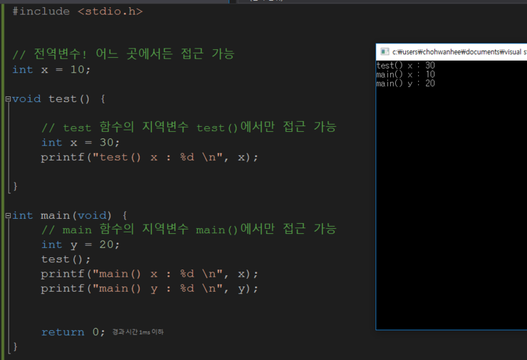
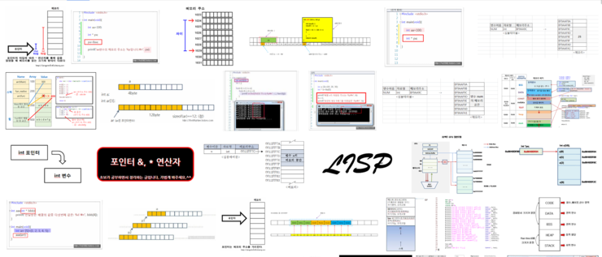
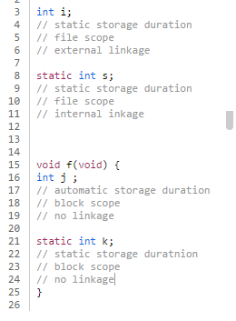
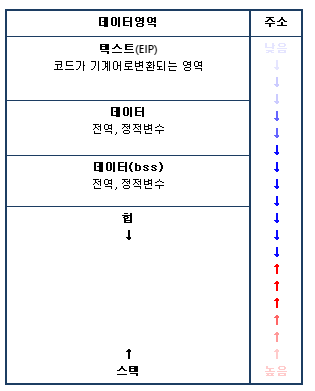

## 포인터! 메모리의 주소
 
자 드디어 올 것이 왔습니다 여러분. C언어 입문자들이 가장 많이 좌절하는 파트입니다. 벌써부터 너무 겁주는것 아니냐!? 라고 하시는 분도 있겠지만, 저도 그랬거든요..ㅎ 처음 보면 정말 이게 왜 필요하고 이게 어디에 쓰는지 이해가 안되실 분들이 많을겁니다. 그래도 저와함께 이게 왜 필요한지! 어디에 쓰는지 한번 알아봅시다.

### 포인터란 뭘까..

아주아주 쉽게 얘기 해볼게요.

철수가 영희네 집을 찾아가려합니다. 영희네 집을 찾아가려면 그 집주소를 알아야겠죠? 그 집주소를 메모지에 적어둡니다. 그 후로는 언제든지 영희네 집을 찾아가서 같이 라면을 먹을수 있겠죠!

포인터도 같은 맥락입니다. 

다른 영역에 있는 변수의 값을 바꾸려고 합니다. 다른 영역의 변수를 바꾸려면 해당 변수의 주소를 알아야겠죠? 변수의 주소를 알아내고 포인터변수에 담아둔다면, 그 후로는 언제든지 그 변수를 찾아가서 값을 바꿀 수가 있게됩니다.

자 이제 지역변수는 뭐며, 주소는 뭐고, 포인터는 어떻게 쓰는지! 하나씩 배워가면서 무슨 얘긴지 알아봅시다. 

### 지역변수와 전역변수

우선은 지역변수와 전역변수의 개념에대해 먼저 집고 넘어가야 합니다. 한 스코프 '{' 내에서 사용 되는 변수는 지역변수, 한 파일 내에서 사용되는 변수는 전역변수라고 생각하시면 됩니다. 아래 그림을 보시죠. (이 이슈는 뒤에 좀 더 자세히 할겁니다. )



### 포인터 사용법, 포인터 또한 단순한 변수다.

이제 포인터 얘기를 해보도록 하죠. 포인터! 포인터하면 뭐가 딱 떠오르시나요?. 아무생각이 안드신다구요..? 이제 저랑 함께 생각을 채워봅시다. 포인터도 단순한 변수입니다. 우리가 주로 접했던 integer 타입, float 타입 double 타입 등등과 마찬가지로 포인터또한 하나의 변수입니다. 이는 주소를 담는 변수라고들 하지요. 

포인터와 관련된 연산자가 있습니다.

```
& : object의 주소를 호출
* 변수명 : 피연산자가 가리키는 object를 간접접근
printf("%d",*np);
tip. object의 주소는 object가 차지하는 저장소 공간의 주소중 가장 낮은 주소를 의미한다.
```

### Q. 주소? 무슨 주소를 말하는건가요?
 


<구글에 C언어 주소를 검색하면 이런 느낌의 사진들이 많이 나옵니다>

조금 어려운 얘기를할게요, 입문하시는 분이라면 가볍게 그렇구나~ 넘기셔도 됩니다! 뒤에 예제를 보고 이해하세요!

주소라하면, 메모리의 주소를 말합니다. 우리가 프로그램을 실행시키면 그 프로그램에 사용되는 데이터들 (int x, int y 이런것들..)이 주기억장치 어딘가에 적재 됩니다. 그러한 주소를 프로그램 단위로 관리하게 되는데, C에서는 크게 네가지의로 변수들의 영역을 분류(Storage Classes)한 후에 실제 메모리에 상주시킵니다.

이때 분류된 영역에 따라 변수들의 생애주기(Scope)가 결정됩니다. 생애주기는 크게 File Scope, Block Scope로 분류가 되는데, 변수들이 한 파일내에서 존재하는지, 아니면 한 블럭내에서 존재하는지를 나타냅니다.

extern,  static,  automatic,  resister




<변수의 생애주기>                                  


<OS단의 메모리 관리 체계>

우리는 이러한 영역으로 관리되는 변수들의 주소를 가지고서 요리를 하는 거죠. extern은 전역, static은 정적, automatic는 동적 그리고 resister 영역을 관리합니다. 이렇게 분류된 Storage Classes를 실제 메모리에 상주 시키는 겁니다.  아래 처럼 말이죠.


### 1. 텍스트 영역

- 작성한 코드가 기계어로 변환되는 영역, EIP는 해당 코드의 흐름을 읽는 레지스트리
- 가장 낮은 주소

### 2. 데이터 영역

- 초기화 된 전역, 정적 변수가 저장되는 공간
- bss영역과 하나로 보는 경우가 많음
- 텍스트 영역보다 높은 주소

### 3. bss영역

- 초기화 되지 않은 전역, 정적변수가 저장되는 공간
- 데이터 영역과 하나로 보는 경우가 많음
- 데이터 영역보다 높은 주소

### 4. 힙 && 스택

- 힙 : 자유영역으로서 주소가 점점 커짐, 동적으로 할당된 메모리가 저장되는 공간
- 스택 : 예외적으로 높은영역에서 낮은영역으로 주소가 할당되는 공간, 지역변수가 저장됨

### Q. 그래, 변수는 메모리 어딘가에 위치한다는건 알겠어요. 그래서요?

포인터는 그 주소를 담는겁니다! ' int x; 라는 변수는 automatic class의 stack 영역에 담겨지겠구나. 그럼 그 주소는 0004A 이니까 int* xp; 라는 변수에 담아놔야겠다. ' 라는게 되죠. 쉽게 풀이하면 다른 영역에 있는 주소를 알아내고 그 영역의 변수에 접근할 수 있다는 의미가 됩니다! 예제를 하나 볼게요.

### 유명한 SWAP 예제입니다.

```
#include <stdio.h>
 
void swap(int x, int y);
void ptrSwap(int* x, int* y);
 
int main(void) {
    int x, y;
 
    x = 10; y = 15;
 
    printf("swap 변경전 : %d %d \n", x, y);
 
    swap(x, y);
    printf("swap 변경후 : %d %d \n", x, y);
 
    ptrSwap(&x, &y);
    printf("ptrSwap 변경후 : %d %d\n", x, y);
 
    return 0;
}
 
void swap(int x, int y){
    int tmp;
    tmp = x;
    x = y;
    y = tmp;
}
 
void ptrSwap(int* x, int* y){
    int tmp;
    tmp = *x;
    *x = *y;
    *y = tmp;
}
```

### 코드 분석
```
#include <stdio.h> standard input / output 헤더파일을 선언합니다. 표준 입출력함수를 포함하고 있는 헤더파일 입니다.
 
void swap(int x, int y); 반환값이 없는 swap 함수를 선언했습니다. 매개변수로 int형 x의 값과 int y의 값을 받습니다.
void ptrSwap(int* x, int* y); 반환값이 없는 ptrSwap 함수를 선언했습니다. 매개변수로 int 형 x의 주소와 int 형 y의 주소를 받습니다.
 
int main(void) {  메인의 매개변수는 없군요..
    int x, y; 오늘의 재료입니다. 두 변수를 바꿀거에요!
 
    x = 10; y = 15; 변수를 초기화 해줬습니다!
 
    printf("swap 변경전 : %d %d \n", x, y); 출력을 하게 된다면 당연히 x 는 10이고 y는 15가 될테지요
 
    swap(x, y); swap함수의 매개변수로 int형 x의 값과 y의 값을 넣었습니다!
    printf("swap 변경후 : %d %d \n", x, y); 출력을 했더니!! 변경전과 같네요..?
 
    ptrSwap(&x, &y); 이번엔 x의 값 대신 x의 주소, y의 값 대신 y의 주소를 넣어줬습니다!
    printf("ptrSwap 변경후 : %d %d\n", x, y); 값을 바꾸는데 성공!
 
    return 0; 메인은 끝났어요 
}
 
void swap(int x, int y){ 스왑의 내용을 자세히 볼까요?
    int tmp; tmp 변수를 하나 만들었습니다.
    tmp = x; x 의 값을 미리 저장해두는군요
    x = y; x에다가 y를 대입했습니다!
    y = tmp; y에 미리 저장해둔, x의 값(tmp)를 넣었씁니다. 
최종적으로 값이 바뀌는 내용이군요
}
 
void ptrSwap(int* x, int* y){ 이번엔 주소를 받아오는 스왑입니다.
    int tmp; 똑같이 tmp를 만들었습니다.
    tmp = *x; tmp에 받아온 x의 주소를 따라가 값을 호출해서 해당 값을 대입합니다. (이하 역참조.)
    *x = *y; y또한 역참조해 얻은 값을 x의 역참조 값에 직접 넣습니다.
    *y = tmp; y의 역참도된 값에 tmp 의 값을 넣습니다.
             최종적으로 변수의 주소들에 접근해서 해당 주소의 값들을 바꾸게 되는군요!
}

```
