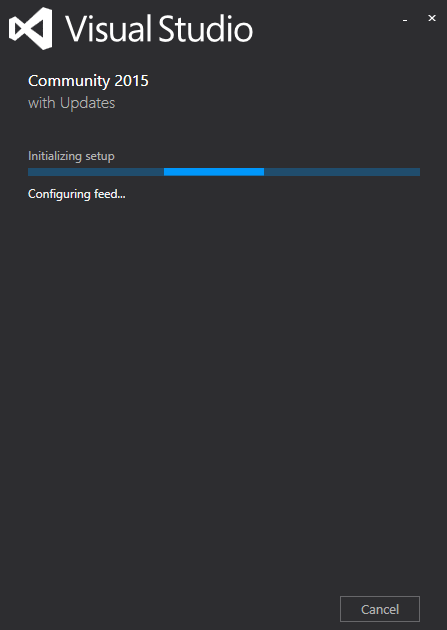
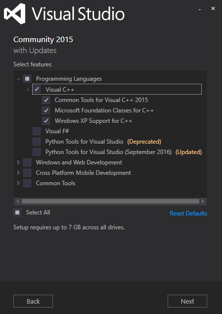
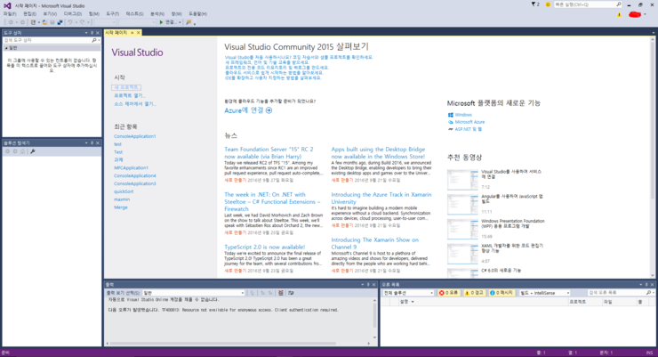

## C언어 환경 설정하기

​지난시간에 우리는 프로그래밍과 C언어에대하여 간단하게 이야기해봤죠. 이번엔 C언어로 컴퓨터에게 대화를 걸어보는 시간을 갖도록 하겠습니다.

### 어떻게 ?

우선적으로! C언어 번역기가 필요합니다. (?? 무슨..??) 사실 C언어는 사람이 이해하기 쉽게 만들어진 '중간언어'라고 볼 수 있습니다. 컴퓨터와 대화하기 위해선 C언어를 기계어로 번역을 해주는 과정이 필요합니다.

컴퓨터는 2진수만 알아듣는다는 사실 아시나요? 011010101011과 같은 숫자들 말예요. 이런 느낌이 기계어라고 생각하시면 됩니다.

그렇다면 기계어도 배워야 하느냐?? 아닙니다! 다행스럽게도 C언어를 기계어로 번역해주는 프로그램이 있습니다. 이를 컴파일러라고 합니다.

### 그래서 뭘 설치하면 되나요?

우리는 이번 강좌에서 visualstudio 2015 community 라는 컴파일러를 사용할 겁니다. 사실 컴파일러의 종류는 매우 다양하며 심지어는 설치가 필요없는 웹 버전도 있답니다.

웹 버전이 궁금하신 분들은 www.codepad.org 사이트를 확인해주셔도 됩니다.

우선 아래 사이트에서 다운을 받습니다.
https://www.visualstudio.com/post-download-vs/?sku=community&clcid=0x409&downloadrename=true

그 다음 이런 창이 뜨면 쭉 넥스트를 누릅니다.

설치는 이렇게 체크해주시구요.

이런 창이 뜨면 성공!!

 

끝, 다음은 "생애 첫 프로그램 도전!"편이 이어집니다.
