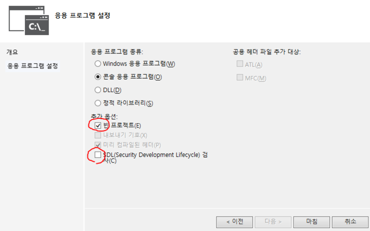
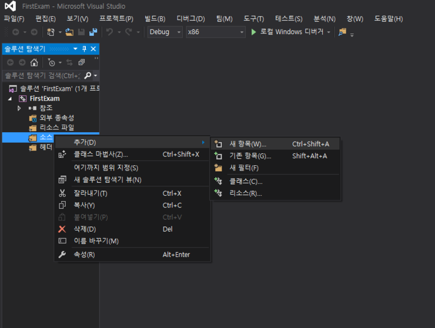
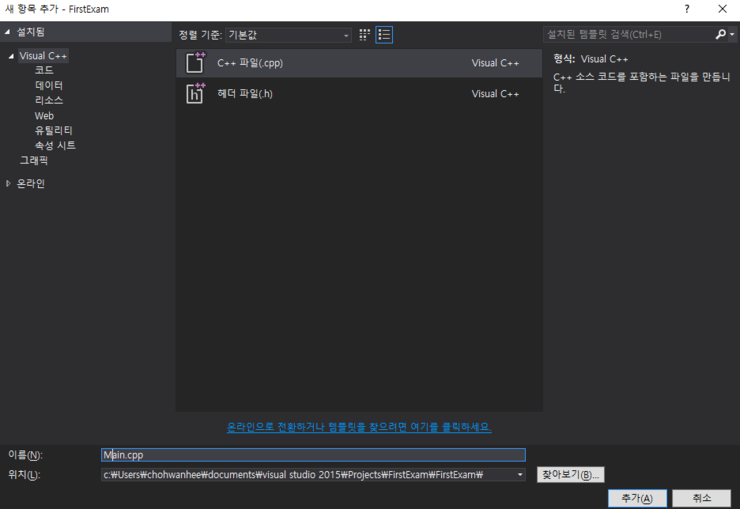
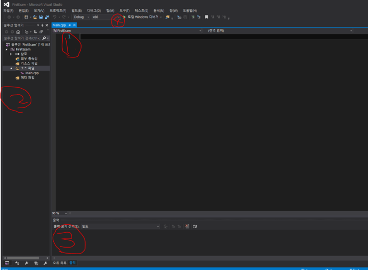
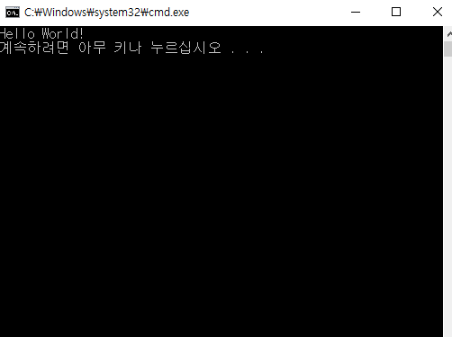

## 첫 프로그램 만들어보기!

안녕하세요! 지난시간에는 C언어 실행환경 설정하기!를 배워봤어요. 이번엔 C언어를 활용한 첫 프로그램을 작성해 보도록 할게요.

## 프로그램은 어떻게 만드나요?

첫 번재, VisualStudio 2015를 켠 후 파일 -> 새로만들기 -> 프로젝트를 선택합니다.
두 번째, 좌측 템플릿에서 Visual C++ -> Win32 콘솔 응용프로그램을 선택합니다.
세 번째, 이름은 간단하게 FirstExam 으로 해봅시다.
그리고 이제 아래 그림을 하나씩 따라해봅시다!











위 그림까지 오셨으면 아주 잘 따라온거에요.
 1번이 소스 입력창,
 2번이 솔루션 목록 창,
 3번이 출력 창
 4번이 빌드 및 디버그 설정 창이에요.

그럼 이제 본격적으로 C언어 소스를 입력해봅시다.

```dart
#include <stdio.h> 
 
int main(void) {
    
    printf("Hello World! \n");
 
    return 0;
}
```


이렇게 소스를 입력하고 ctrl + F5를 눌러줍시다!




<성공적으로 프로그램을 완성 시킨 모습>


이상으로 다음시간에는 Hello World 프로그램 분석! 으로 찾아 뵙겠습니다.

 

