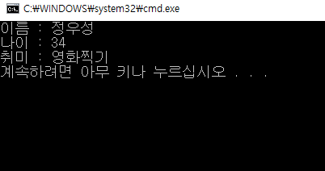

## Hello World 분석하기 두 번째 시간

​안녕하세요! 지난시간에는 응용프로그램이 어떻게 만들어 지는지를 배워봤어요! 이번 시간에는 정말로 Hello World 프로그램을 알아보도록 해요 'ㅁ'


### C언어 소스?

```C
#include <stdio.h> 
 
int main(void) {
    
    printf("Hello World! \n");
 
    return 0;
}
```

위 소스는 우리가 처음으로 작성했던 C언어 소스입니다. 이 소스는 크게 세 과정을 거쳐 프로그램이 된다고 설명 드렸었죠? 컴파일러에 의해서 컴파일되고, 컴파일 된 내용이 프로그램이름.exe로 생겨나는 겁니다.


그렇다면, 컴파일러는 C언어를 어떻게 해석할까요?


### 먼저 #include <stdio.h>

요 녀석은 '전처리기'라고 부르는데, 프로그램이 실행되기 전 사전 처리해야하는 작업을 의미합니다. 운동하기전에 '준비운동'과 비슷하다고 생각하시면 됩니다.

※ #include <stdio.h>의 의미는 표준입출력 헤더 파일(stdio.h : standard Input Output의 약자)을 소스에 포함 시킨다는 의미에요. 표준으로 정의된 함수(일종의 명령어 모음)들을 모아둔 파일이 stdio.h 파일이랍니다. stdio.h 말고도 math.h (수학적인 계산을 하는 함수들을 모아둔 헤더파일)등 여러 파일들을 #include 명령문을 통해 포함이 가능 합니다.


### 두번째로 int main(void) { }

이라고 적혀 있는 곳을 찾아갑니다. 그리고 '{   }' <-- 이 중괄호 사이의 내용을 읽어들여 프로그램을 만들어가는 거랍니다. 그러니, int main 이 없는 C언어 프로그램은 상상할 수 없겠죠?
(※ main 함수라고 읽으면 됩니다.)

### 그 다음 printf("Hello World! \n");

를 읽습니다. 이는 화면에 Hello World를 출력하라! 라는 의미입니다. 여기서 우리는 printf();라는 녀석이 무언가를 출력해주는 거구나! 라고 생각을 할 수 있겠죠?  ' (  ) ' 이 작은 괄호 안에 "문자열"을 입력해주면 됩니다.


### 그리고나서 return0; 

을 읽어 들여 main함수를 종료하게 됩니다. 이 부분은 추 후에 자세히 설명을 할거에요! 지금은 '아 프로그램이 종료되는구나' 정도로 이해하시면 됩니다.


### 실습해 보아요.

화면에 자신의 이름, 취미등을 출력하는 프로그램을 만들어봅시다!



이런식으로 출력이 되도록 말이에요!