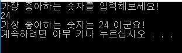

안녕하세요! 둥둥입니다.


글이 조금 늦었네요.. 프로젝트 준비하느라 시간이...


각설하고! 오늘은 스트림에 대해 알아보고,

변수에 값을 입력해볼거에요!

입력과 출력


 C에서는 입력과 출력 그리고 스트림이라는 개념이 있습니다. 

 그게 뭐다냐?

 데이터의 입력과 출력은 한 프로그램을 중심으로 데이터의 이동을 말하는 것 입니다. 프로그램 밖으로 나가면 출력이되겠고 프로그램 내부로 들어오게 되면 입력이 되겠죠.

 스트림은요? 스트림은, 위 과정에서 데이터가 이동하는 '통로'를 의미합니다.


예를 들어봅시다.


 키보드로 입력한 값이 5 이고, 이를 화면에 출력하려할 때

 1) 입력스트림(Stream) 로부터 5라는 데이터가 프로그램으로 들어오게 됩니다.

 2) 프로그램은 5라는 데이터를 출력스트림으로 보내주게됩니다.

 3) 출력스트림으로부터 받은 데이터를 화면에 뿌려줍니다.

출력스트림, 입력스트림 사용하기


 우리는 저번 시간에 가장 좋아하는 숫자를 출력했었죠, 그게 바로 출력 스트림입니다. 

 printf라는 함수를 이용해서 출력한걸 기억하세요!


 그렇다면 입력스트림같은 경우엔 어떻게 해야할까요? 예제를 봅시다.

가장 좋아하는 숫자 입력하고 출력하기

```
#include <stdio.h>
 
int main(void) {
    int number;
 
    printf("가장 좋아하는 숫자를 입력해보세요!\n");
    scanf("%d", &number);
 
    printf("가장 좋아하는 숫자는 %d 이군요!\n", number);
 
    return 0;
}
```

출력




 예제 분석은 다음시간에 같이 해봐요!

※ 기억하세요!

출력에는 printf

입력에는 scanf

(눈치가 빠르신 분들은 scanf에 '&' 기호가 포함된걸 보셨을 거에요, 다음 시간에는 같이 생각하는 시간을 가져봅시다!)

